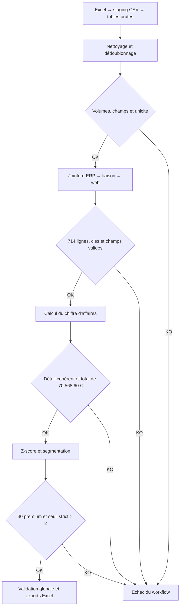

# Pipeline de données Bottleneck avec Kestra et DuckDB

Ce projet réconcilie les données produits de l'ERP et du site web à l'aide d'un fichier de liaison. Le workflow nettoie et dédoublonne les sources, calcule le chiffre d'affaires, classe les vins avec un z-score, puis publie les rapports dans Kestra.

## Résultats de référence

Avec les trois fichiers Excel fournis, le pipeline produit les résultats suivants :

- 714 produits fusionnés avec des clés uniques ;
- chiffre d'affaires total : **70 568,60 €** ;
- prix moyen : **32,493137 €** ;
- écart type population : **27,791043 €** ;
- 30 vins premium (`z_score > 2`) ;
- 684 vins ordinaires (`z_score <= 2`) ;
- 11 contrôles qualité validés.

## Architecture du workflow



La jointure suit le chemin suivant :

```text
ERP.product_id → liaison.product_id
liaison.id_web → web.sku
```

Le fichier web contient souvent deux lignes pour un même `sku` : une ligne `product` et une ligne `attachment`. Le pipeline conserve uniquement `post_type = 'product'`.

Les valeurs manquantes ne sont supprimées que sur les colonnes indispensables aux jointures et aux calculs. Supprimer toute ligne contenant un `NULL` dans l'une des 28 colonnes web éliminerait des produits pourtant exploitables.

La classification utilise la formule :

```text
z-score = (prix du vin - prix moyen) / écart type des prix
```

Un vin est classé **premium** si son z-score est strictement supérieur à 2. Tous les autres vins sont classés **ordinaires**.

## Arborescence du projet

```text
.
├── bottleneck/
│   ├── Fichier_erp.xlsx
│   ├── fichier_liaison.xlsx
│   └── Fichier_web.xlsx
├── kestra/flows/
│   └── bottleneck_pipeline.yml
├── sql/
│   ├── 00_load_raw.sql
│   ├── 01_remove_missing_values.sql
│   ├── 02_deduplicate.sql
│   ├── 03_merge_systems.sql
│   └── 04_calculate_revenue.sql
├── src/data_pipeline/
│   ├── __init__.py
│   └── cli.py
├── tests/
│   └── test_pipeline.py
├── Dockerfile
├── docker-compose.yml
├── poetry.lock
├── pyproject.toml
└── README.md
```

## Prérequis

- Docker Desktop avec Docker Compose ;
- un navigateur web ;
- Poetry uniquement pour l'exécution locale hors Kestra.

Le projet fonctionne sur Mac Apple Silicon. L'image personnalisée installe les dépendances dans le Python système `/usr/bin/python3`, car l'environnement virtuel interne de l'image Kestra ne contient pas `pip`.

## Démarrage avec Kestra

### 1. Construire et démarrer les conteneurs

Depuis la racine du dépôt :

```bash
docker compose build --no-cache kestra
docker compose up -d
```

Vérifier que le service est démarré :

```bash
docker compose ps
```

Puis ouvrir [http://localhost:8080](http://localhost:8080). Lors du premier accès, terminer la création du compte Kestra. Ces mêmes identifiants seront nécessaires pour déployer le flow avec la CLI.

### 2. Vérifier les dépendances Python

```bash
docker compose exec kestra /usr/bin/python3 -c \
  "import duckdb, pandas, openpyxl, xlwt; print('Dépendances Python : OK')"
```

Résultat attendu :

```text
Dépendances Python : OK
```

### 3. Valider le flow

Remplacer les deux valeurs entre chevrons par les identifiants utilisés dans l'interface Kestra :

```bash
docker compose run --rm --no-deps kestra flow validate \
  /app/project/kestra/flows \
  --server http://kestra:8080 \
  --user='<EMAIL>:<MOT_DE_PASSE>'
```

L'URL `http://kestra:8080` est volontaire : la commande s'exécute dans un conteneur temporaire et contacte le serveur Kestra par son nom de service Docker.

### 4. Déployer le flow

```bash
docker compose run --rm --no-deps kestra flow namespace update \
  com.bottleneck.data \
  /app/project/kestra/flows \
  --no-delete \
  --server http://kestra:8080 \
  --user='<EMAIL>:<MOT_DE_PASSE>'
```

Les commandes `flow validate` et `flow namespace update` sont encore fonctionnelles dans l'image utilisée par ce projet. Kestra peut afficher un avertissement indiquant qu'elles sont dépréciées au profit de `kestractl` ; cet avertissement n'empêche ni la validation ni le déploiement.

Après le déploiement, actualiser l'interface puis ouvrir :

- namespace : `com.bottleneck.data` ;
- flow : `bottleneck_pipeline`.

### 5. Exécuter le pipeline

Ouvrir le flow et cliquer sur **Execute**. Après chaque redéploiement du YAML, lancer une **nouvelle exécution** afin d'utiliser la dernière révision ; ne pas relancer l'ancienne exécution avec **Restart** ou **Replay**.

Une exécution correcte se termine avec l'état `SUCCESS`. Les rapports sont disponibles dans l'onglet **Outputs** de l'exécution.

## Fichiers produits

| Sortie | Format | Contenu |
| --- | --- | --- |
| `rapport_chiffre_affaires.xls` | XLS | CA par produit et CA global, format demandé |
| `rapport_chiffre_affaires.xlsx` | XLSX | Même rapport dans un format Excel moderne |
| `vins_premium.csv` | CSV | Vins ayant un `z_score > 2` |
| `vins_ordinaires.csv` | CSV | Vins ayant un `z_score <= 2` |
| `quality_report.json` | JSON | Valeurs obtenues/attendues et résultat des 11 contrôles qualité |

Le flow produit également `zscore_metrics.json` au niveau de la tâche de segmentation. Les fichiers sont publiés directement par les tâches qui les créent grâce à `outputFiles`, puis exposés comme sorties globales du flow.

## Contrôles qualité

Le pipeline vérifie automatiquement :

- les volumes après dédoublonnage ERP : 825 lignes attendues ;
- les volumes après dédoublonnage de la liaison : 825 lignes attendues ;
- les volumes après nettoyage web : 1 428 lignes attendues ;
- les volumes après dédoublonnage web : 714 lignes attendues ;
- que la table fusionnée n'est pas vide ;
- l'unicité de `product_id` ;
- l'unicité de `id_web` ;
- l'absence de valeurs nulles dans les champs métier requis ;
- la présence de chaque produit dans la segmentation ;
- la partition exhaustive entre vins premium et ordinaires ;
- la réconciliation entre le CA détaillé et le CA global.

Pour les quatre contrôles de volumétrie, le rapport expose `actual`, `expected` et `passed` dans la section `row_count_tests`. Si un contrôle échoue, la tâche `validate_pipeline` passe en erreur et le rapport précise le contrôle concerné.

## Exécution locale sans Kestra

Installer les dépendances puis exécuter le pipeline :

```bash
poetry install
poetry run python -m data_pipeline.cli run \
  --input-dir bottleneck \
  --work-dir build
```

Les fichiers sont créés dans `build/outputs/`.

## Tests automatisés

```bash
poetry install
poetry run pytest
```

Le test d'intégration exécute le pipeline complet et vérifie notamment les 714 produits fusionnés, le CA total de 70 568,60 €, la répartition premium/ordinaire et la présence des exports.

## Dépannage

### `pull access denied for bottleneck-kestra:local`

Docker cherche d'abord l'image localement ou dans un registre, puis la construit à partir du `Dockerfile`. Si la construction démarre juste après ce message, aucune connexion à un registre privé n'est nécessaire.

### `/.venv/bin/python3: No module named pip`

Utiliser le `Dockerfile` fourni et reconstruire l'image :

```bash
docker compose build --no-cache kestra
docker compose up -d
```

Le `Dockerfile` cible explicitement `/usr/bin/python3` pour l'installation et le flow utilise le même interpréteur pour toutes ses tâches.

### `exec /app/kestra: exec format error`

Ne pas appeler `/app/kestra` directement avec `docker compose exec`. Utiliser les commandes `docker compose run --rm --no-deps kestra ...` documentées plus haut afin de passer par le lanceur de l'image.

### `Client 'remote-api': Unauthorized`

Ajouter l'option suivante aux commandes de validation et de déploiement :

```text
--user='<EMAIL>:<MOT_DE_PASSE>'
```

Il faut utiliser les identifiants exacts du compte créé dans l'interface Kestra. Conserver les apostrophes si le mot de passe contient des caractères spéciaux.

### Warning Prometheus au lancement de la CLI

Le warning lié à `PrometheusMeterRegistry` n'est pas bloquant. La commande peut continuer normalement.

### `openpyxl`: `Unknown extension is not supported and will be removed`

Cet avertissement concerne une métadonnée Excel non prise en charge, pas les cellules utilisées par le pipeline. Les fichiers sources sont seulement lus et ne sont pas réenregistrés : les données, les jointures et les calculs ne sont pas affectés.

### Sortie `pipeline_workdir.uris` introuvable

Utiliser la version actuelle de `kestra/flows/bottleneck_pipeline.yml`. Chaque tâche publie désormais ses propres artefacts avec `outputFiles`, ce qui évite de dépendre de `pipeline_workdir.uris`.

Après avoir remplacé le YAML, le redéployer puis lancer une nouvelle exécution.

## Documentation utile

- [Validation et déploiement des flows](https://kestra.io/docs/version-control-cicd/cicd)
- [Authentification Basic de Kestra](https://kestra.io/docs/administrator-guide/basic-auth-troubleshooting)
- [Partage d'un répertoire de travail entre les tâches](https://kestra.io/docs/scripts/working-directory)
- [Publication de fichiers avec `outputFiles`](https://kestra.io/docs/scripts/input-output-files)
- [Nouvelle CLI `kestractl`](https://kestra.io/docs/kestra-cli/kestractl)
